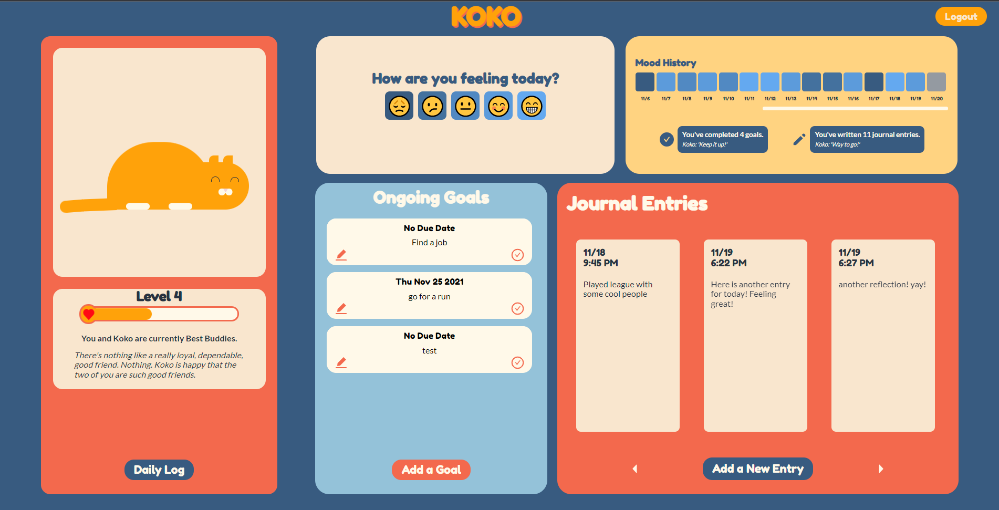
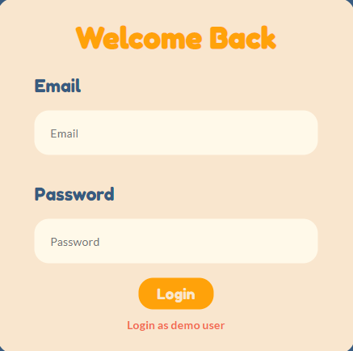
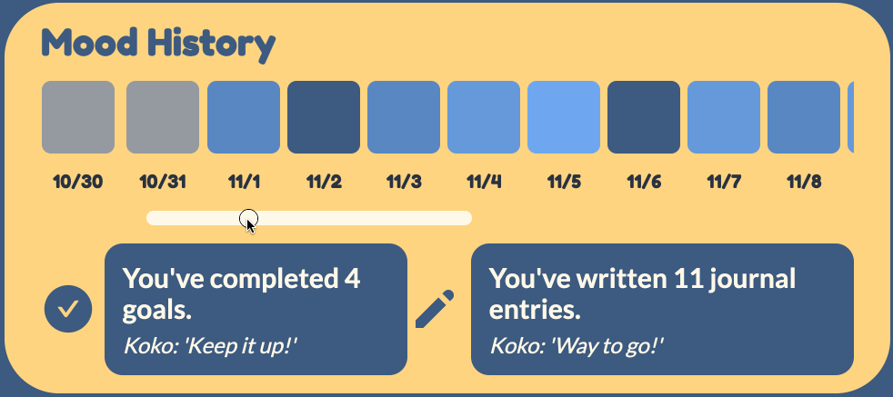

# Welcome to Koko!

## Who is Koko?

[Koko](https://koko-the-cat.herokuapp.com/#/) is your mental health ability partner. Koko's goal is to facilitate healthier mental wellness by encouraging healthy habits such as mood tracking, goal setting, and journaling. Koko allows users to set personal goals for themselves, creating a safe space of accountability towards a brighter and healthier future.

## Notable Technologies used

_Database:_

- MongoDB
- Mongoose

_Backend:_

- Express
- Node.js

_Frontend:_

- React
- Redux
- HTML5
- CSS3
- SCSS

## Notable Features

### **User Authentication**

Users can create new accounts which they can use to log in and out of Koko. On successful login, they will be routed to the main app. On unsuccessful login, errors will be displayed in red. A demo user is provided so that users can browse the site without having to create an account themselves.

<div
  style=
    "display: flex;
    justify-content: space-evenly;
    align-items: center;
    text-align: center;
    font-size: 0.75em;
    font-style: italic;">
  <div style=>
    
    <figcaption>On sucessful login</figcaption>
  </div>
  <div style="text-align: center;">
    
    <figcaption>On unsuccessful login</figcaption>
  </div>
</div>

### **Full CRUD cycles for "Reflections" and "Goals"**

Users can create, read, update, and delete both goals and reflections. Any changes will be persisted upon refresh and login/logout.

```js
// frontend/src/components/reflections/ReflectionShowForm.jsx

  const [editMode, setEditMode] = useState(false);

  const onSubmit = (data) => {
    const formReflection = {
      user: currentUser.id,
      entry: data.entry,
    };
    if (reflection) formReflection['id'] = reflection._id;

    const processForm = editMode ? updateReflection : createReflection;

    processForm(formReflection).then((action) => {
      if (!reflection) {
        updateExp(currentUser.id, 2);
      }
      setEditMode(false);
      openReflectionShow(action.reflection._id);
    });
  };

  const handleDelete = () => {
    openModal({
      type: 'deleteReflection',
      reflection: reflection,
      closeForm: closeForm,
    });
  };
```
<figcaption style="font-size: 0.75em; font-style: italic; text-align: center;">
  Leveraging modern React hooks and custom hooks in order to render specific components for CRUD.
</figcaption>

### **Monthly Log**

The calendar was customized using CSS3 properties in order to achieve the exact aesthetics envisioned from the mockups. The calendar is fully functional and will retrieve the journal reflections, goals, and mood of the date selected.

### **Mood Garden**

On the home screen, users have access to visual data representation of their moods since the creation of their account. Their moods will be represented with a gradient of colors to signify their recorded mood for each day.

<div
  style=
    "display: flex;
    justify-content: space-evenly;
    align-items: center;
    text-align: center;
    font-size: 0.75em;
    font-style: italic;">
    <div>
      
      <figcaption>Mood Garden</figcaption>
    </div>
</div>

## Meet the Team

Stella Kang // Tech Lead
[LinkedIn](https://www.linkedin.com/in/stella-kang-33302b127/)

Mansoo Kim // Flex Developer
[LinkedIn](https://www.linkedin.com/in/mansoo-kim/)

Emmay Alam // Backend Lead
[LinkedIn](https://www.linkedin.com/in/emmay-alam/)

Victor He // Frontend Lead
[LinkedIn](https://www.linkedin.com/in/victor-he/)
